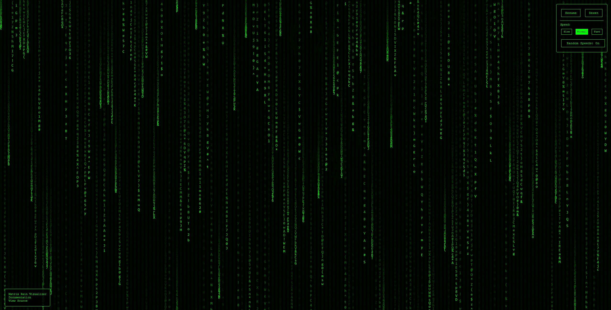

# Matrix Rain

Matrix-style rain effect visualizer with PyScript.

## Live Demo

[rain.kahdev.me](https://rain.kahdev.me)

## Documentation

[View Documentation](https://rain.kahdev.me/docs/)

## Features

* Interactive mouse/touch repulsion effect
* Speed controls (slow, normal, fast)
* Random speed variation
* Fully responsive

## Local Development

```bash
# Clone the repository
git clone git@github.com:khesse-757/matrix-rain.git
cd matrix-rain

# Create virtual environment
python3 -m venv venv
source venv/bin/activate

# Install dependencies
pip install -e .[dev]

# Run tests
pytest

# Serve locally
python3 -m http.server 8000
```

## Docker

```bash
# Build and run
docker compose up

# Access at http://localhost:8000
```

## License

MIT